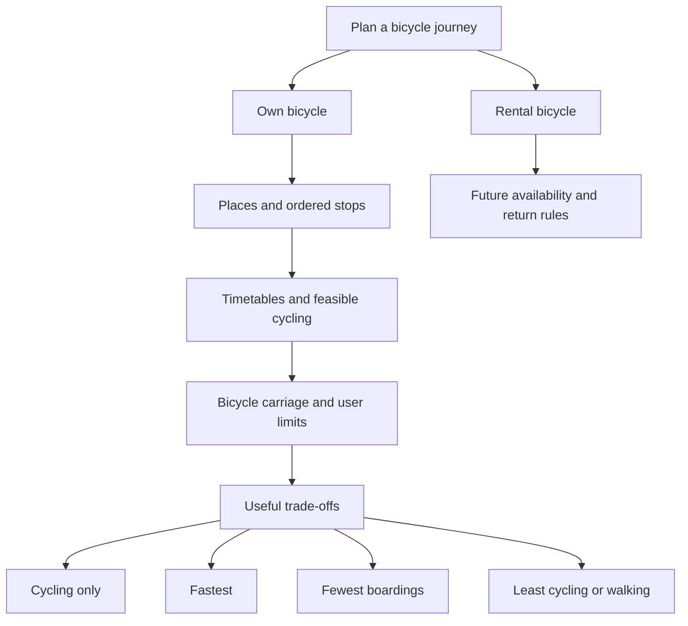

# App roadmap: bike + public transport

_Updated 2026-09-20. This document records the requested future work; it does not mean these features are already implemented._

## Product direction

**Decision:** Start with people taking their own bicycle on public transport in Switzerland. Help them compare a small set of useful journeys: cycling only, fastest overall, fewest boardings, and least cycling or walking. Make the reasons for each proposal understandable.

**Product vision:** Support daily commuting and bikepacking, then let people save and share useful experiences. Rental-bike planning is a separate future branch because bike availability, pickup, return and one-way restrictions change the problem.

**Hypothesis:** A clear interface, bicycle-specific information and well-chosen alternatives can provide value on top of an existing routing engine. We have not established that no competing app offers this combination, or that the current prototype outperforms OpenTripPlanner.

Each result is a complete journey, not a disconnected collection of legs. A single journey can win several categories. An unavailable category should have a clear explanation; do not fabricate an alternative just to fill the screen.

## Implemented in this update

**Fact:** Clicking or tapping the map offers **Start here**, **Finish here** and **Add intermediate stop**. Start, finish and intermediate markers can be dragged. Fields show a nearby place name when lookup succeeds, otherwise exact coordinates remain usable. Naming does not move the selected position or silently select a nearby station.

Up to **four intermediate stops** can be added by map or address search, reordered and removed. Reverse route reverses endpoints and stop order. The planner must visit stops in that order; the cycling-only comparison includes them too. Transit acquisition uses reachable arrival times for onward stages, and cycling, boarding and elapsed-time budgets remain shared across the whole journey. Stopover duration is currently zero; boarding buffers still apply.

**Current limits:** Cycling is still straight-line distance at 15 km/h. Bicycle carriage, reservations and capacity are not checked. Timetable discovery is a bounded sample and can miss connections. Map naming and tiles depend on external services. This update adds no road-routing, amenity or community service. See [the mathematical model](MATHEMATICAL_MODEL.md) and [verification log](EXPERIMENTS.md).

## Recommended delivery order

| Priority | Work | Completion criteria |
|---|---|---|
| 1 | Real cycling routes and routing-engine evaluation | Cycling follows legal, connected roads/paths; those durations determine train catchability. Compare fixed Swiss cases against a configured routing engine and record omissions. |
| 2 | Bicycle carriage and station guidance | Every transit leg distinguishes allowed, prohibited and unknown; reservation requirements and capacity are separate fields, with sources and update dates. |
| 3 | Road profile and useful nearby services | Route distance/elevation/surface summaries have known coverage; repair and parking locations have useful details without invented availability. |
| 4 | Commuting, bikepacking and expert controls | Presets use the same underlying engine and explain constraints; advanced options expose supported attributes and disclose missing data. |
| 5 | Saved journeys and community pilot | Users can save/share a route with context; live schedules and operator rules are refreshed before reuse. |

### 1. Real cycling routes and an engine decision

Replace geometric links with a cycling route for **every** access, egress, required stop and automatic cycling transfer. Use routed distance and time for feasibility as well as drawing: a prettier line alone would leave missed trains and false shortcuts unresolved. Do not silently fall back to a straight line and call it a navigable route when a router fails.

Retain route geometry and raw segment attributes so the interface can explain choices and support later ranking. Show:

- distance, estimated riding time, ascent, descent and an elevation profile;
- sustained/max gradient and uphill distance near the destination;
- separated cycle tracks, on-road lanes, shared paths and mixed-traffic sections;
- surface, roughness, stairs, gates, tunnels and known access restrictions;
- posted speed limits where mapped, separately from measured vehicle speeds or traffic volumes;
- data coverage and unknown sections, so missing attributes do not look favourable.

**Next technical experiment:** Configure an [OpenTripPlanner 2.9 evaluation](https://docs.opentripplanner.org/en/v2.9.0/) with appropriate Swiss timetable and street data. Check bicycle accompaniment, access/egress limits, intermediate cycling, ordered stops and alternative generation rather than assuming equivalence from feature names. Keep the interface and bicycle guidance separable from the engine. Record the comparison in [EXPERIMENTS.md](EXPERIMENTS.md); adopt the engine if it meets the requirements rather than extending the prototype indefinitely.

Acceptance cases include Libingen → EPFL with Wil and Rapperswil access, Zürich → Laax with its walking transfer, an overnight journey, a road barrier that invalidates a straight-line shortcut, and an ordered stop that changes the onward train. Record exact dates, inputs, raw responses and route attributes. Wider sampling remains important when a feasible route is absent; an empty sample is not proof of impossibility.

### 2. Bicycle carriage and practical boarding instructions

For each train, bus or other service, show bicycle permission, relevant time/route restrictions, reservation requirements, bicycle ticket requirements and known bike-space information. Keep **permission**, **reservation required**, **reservation obtainable** and **live capacity** separate. Unknown permission must remain unknown.

Provide a concise checklist explaining the operator's published procedure: ticket/reservation link, where to board when known, and relevant boarding or storage instructions. Link to the authoritative operator page and show when the rule was checked. Track exceptions by service/date and bicycle type; do not assume all trains of a category or all panoramic trains accept bikes. Station access, lifts, stairs and realistic transfer time need their own data.

Acceptance: test at least one allowed, prohibited, reservation-required and unknown service; a prohibited leg cannot win a bicycle-compatible category, and missing reservation/capacity data is visible before the user relies on a proposal. Do not promise a bookable journey without the required availability integration.

### 3. Repair shops and bicycle parking

**Repair layer:** Shops, repair services, public pumps and self-service stands as distinct types. Show name, location, source, known opening hours/contact and cycling detour from the selected route. Treat unverified hours as unknown. Let users hide the layer; do not automatically turn every nearby shop into an intermediate stop. Offer an explicit **Add as stop** action.

**Parking layer:** Show parking type, mapped capacity, covered/secure/lockable attributes, access conditions and price where available. Distinguish a mapped parking location and its nominal capacity from **spaces available now**. Only display live occupancy with a suitable feed and freshness timestamp; otherwise say availability is unknown. Keeping a bike at a station changes the current “bike accompanies the traveller” assumption and must be an explicit future choice.

Acceptance: filter/inspect map pins, handle duplicates and missing attributes, show the route detour, and avoid labelling a static capacity as a live count. Investigate OpenStreetMap and local/operator datasets, their coverage, update process and reuse conditions before promising completeness.

### 4. Three user modes

Commuting and bikepacking should be understandable presets. Expert exposes supported controls on the same planner; it is not a third routing engine. The current Baseline/Extended comparison is an experiment and should eventually move out of the main user decision flow.

| Mode | Intended behavior | Controls to deliver |
|---|---|---|
| Commuting | Predictable daily journeys, clear arrival time and manageable effort | Arrive-by, repeated trips, cycling cap, reliable transfer margins and a gentle finish. |
| Bikepacking | Longer trips with attractive cycling stages and public transport where useful | Total/per-day distance, duration, surface and bike suitability, designated cycle routes, traffic avoidance, ordered stages and optional overnight stops. |
| Expert | Explicit trade-offs and limits | Cycling: fastest, lower stress, less climbing, maximum distance, surface exclusions and gentle final kilometres. Transit: fastest, fewest boardings, maximum changes/wait and optional panoramic preference. |

“No uphill in the final kilometres” needs **distance, gradient tolerance and maximum positive ascent**; net elevation change can hide a climb followed by a descent. Explain when a hard requirement makes the journey infeasible and offer a relaxation without silently changing it. Separate a preference from a maximum the user cannot exceed.

Panoramic service selection needs a curated, attributable definition and a permitted detour allowance. Scenic/designed cycle routes are useful inputs, but neither implies low traffic, a suitable surface or objective safety. Longer bikepacking routes need explicit larger horizons and daily limits; simply increasing today's 24-hour search window is insufficient.

**Useful additional options:** bicycle type/loaded weight, e-bike assumptions, avoid stairs or unpaved surfaces, transfer time with luggage, maximum waiting, arrive-by, stopover duration, and a fallback station to end a ride early. Add only controls backed by data and understandable effects.

### 5. Comfort, safety and community

**Decision:** Begin with an explainable **lower-stress / infrastructure-preferred** score. Keep the user's broader safety idea: include road speed, traffic exposure where available, junction/crossing complexity, separation quality, surface and gradients, not only the presence of a cycle path. Preserve each factor and uncertainty; a single number must not imply a measured accident risk.

**Open research:** Define factors with cyclists, validate on contrasting real routes and investigate independent evidence. Do not market “safest route” from incomplete map attributes. Community reports can add dated local context, but should not silently override authoritative restrictions.

After the planning foundation works, pilot saved commute templates and shareable bikepacking itineraries, then experiences, photos, ideas and suggested improvements. Plan visibility/privacy, moderation, reporting and stale-information handling before opening contribution features. Saved itineraries are experiences or templates; recheck timetables and bicycle rules for a new travel date. Commercial bikepacking offers or ticket sales require a separate product decision.

## Decisions still needed

1. Which corridor and representative journeys define the first road-routing pilot?
2. Which bicycle-rule sources and live parking feeds can we actually maintain?
3. How should bikepacking balance scenery, traffic exposure, surface, distance and climbing?
4. What are the default distance/gradient thresholds for a gentle commute finish?
5. When should the engine comparison replace the experimental Baseline/Extended controls?

These questions do not block the map update. The next concrete development task is the routed-cycling/engine pilot, followed by bicycle-carriage feasibility before presenting journeys as practically verified.
