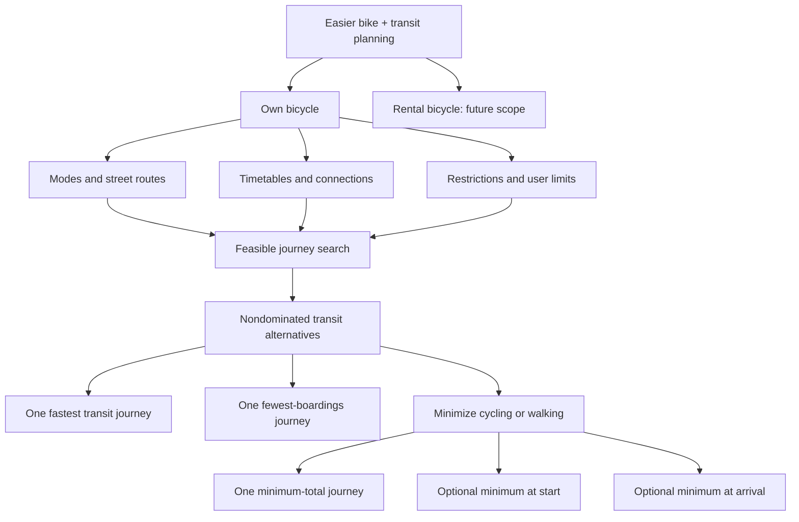

# Journey comparison and map

_Updated 2026-09-20. Facts and implemented decisions are distinguished from future product scope._

## Product objective and tree

**Decision:** Help people plan useful bike + public-transport journeys and understand alternatives they might otherwise miss. Own-bicycle and rental scenarios need different feasibility rules. Current implementation continues the bounded own-bicycle mathematical experiment; rental pickup/return and real bicycle-carriage validation are not implemented.

The three inputs under own bicycle are jointly required, not competing journey types. This is a product decomposition, not an algorithm execution graph. The current experiment uses routed cycling and assumes a bicycle remains available; the tree's full restrictions layer is a target, not a claim of verified carriage feasibility. Both optional endpoint categories are shown in the product tree; the current interface enables one at a time.

**Decision:** A cycling-only reference is shown alongside this transit tree, before the fastest transit card. It is not a member of the transit Pareto set. Category winners can coincide and then share one card. They do not exhaust the frontier; showing additional compromise journeys remains an open product question.

## Implemented comparison behavior

- Compute a road-following cycling-only route through the requested stops using the same departure instant. Its terrain-aware estimated times also govern mixed-journey feasibility; unavailable links have no geometric fallback.
- Publish the reference when all its road stages are ready, independently of timetable acquisition. A completed reference survives timetable failure and cancellation; pending/unavailable states are explicit.
- List cycling only first, then fastest transit, fewest boardings and least cycling-or-walking winners; merge duplicate transit winners.
- Minimize A = cycling + timed walking for the active category. Count endpoint walking before the first boarding / after the last alighting for optional endpoint preferences. Preserve cycling and walking individually.
- Retain the same cycling budgets and Baseline/Extended semantics. Mark an over-budget cycling reference without treating it as an eligible transit alternative. Walking currently has no separate cap beyond the journey horizon.
- Count every actual vehicle boarding, including the first. Keep ordinary changes as supplementary information.

## Implemented map behavior

| Mark | Meaning |
|---|---|
| A / B | Resolved origin / destination |
| Small stop marker | Endpoint candidate or observed timetable stop in this sampled search |
| Numbered pin | Boarding or alighting on the selected journey; number matches the travel plan |
| Blue line | Selected transit leg; geometry is schematic |
| Green line | Routed cycling within the selected transit journey |
| Orange / light-blue cycling segment | Sustained steep climb / descent |
| Grey dashed line | Timed walking leg or explicitly unverified short path connector |
| Purple line | Routed cycling-only reference; emphasized when selected |

A numbered pin opens the available service, scheduled time, platform and boarding number. One physical stop ID can hold both an arrival and an onward boarding, or repeat visits. A train station and nearby bus station with different IDs keep separate pins, showing the walking connection between them. Missing coordinates never produce invented pin positions. Text from transport data is inserted as text rather than interpreted as HTML.

The explored-stop toggle leaves selected journey pins visible. Fit all stops reveals candidates outside the current route view. Nearby numbered pins are separated in screen space, with leader lines retaining their exact geographic anchors; the layout updates on zoom. Background results update markers without repeatedly resetting the user's zoom. Container resizing refits the current route or all-stop view with room for controls and the legend. All observed stop names also appear under Stops explored.

The selected cycling leg has a linked elevation profile, pointer/keyboard/touch inspection and distance, time, ascent/descent, final-climb, surface, infrastructure and posted-speed-band summaries. Unknown data stays visible. See [CYCLING_ROUTES.md](CYCLING_ROUTES.md).

**Limit:** The layer does not show every Swiss station or certify exhaustive service exploration, accessibility, bicycle permission, reservations or capacity. Cycling data uses a separate bounded road service; stop pins reuse timetable data.

## OpenTripPlanner assessment

**Fact from OTP 2.9 documentation:** OTP already supports bicycle-on-transit, rental modes/GBFS, multimodal street/timetable routing and Pareto alternatives using time, transfers and generalized cost. Combining bikes and transit or using Pareto comparisons is not an established differentiator for this project.

**Decision:** OTP remains the first engine candidate. This incremental implementation does not install it or claim an algorithmic advantage.

**Open compatibility questions:** Can configured OTP preserve the exact active-time/endpoint trade-offs, cycling resource budgets, and zero-versus-at-most-one intermediate cycling leg? Which Swiss permission/reservation fields can be supplied reliably? Re-ranking a returned list cannot restore a candidate discarded during search.

**Next experiment:** Run a small fixed Swiss journey set through an OTP deployment with timetable and street data. Compare feasible results, missing trade-offs, restrictions and latency before justifying custom routing extensions.

Primary sources checked during the preceding design discussion:

- [OTP 2.9 overview](https://docs.opentripplanner.org/en/v2.9.0/)
- [Own bicycle and rental routing modes](https://docs.opentripplanner.org/en/v2.9.0/RoutingModes/)
- [GBFS support](https://docs.opentripplanner.org/en/v2.9.0/GBFS-Config/)
- [Route requests and itinerary filtering](https://docs.opentripplanner.org/en/v2.9.0/RouteRequest/)
